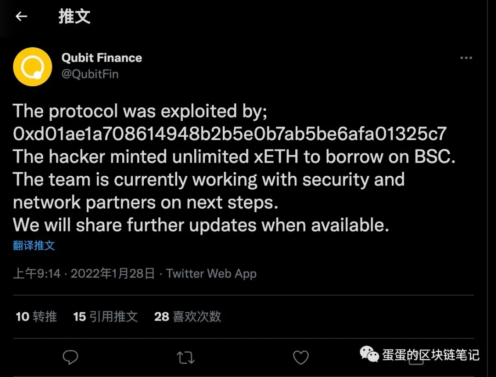
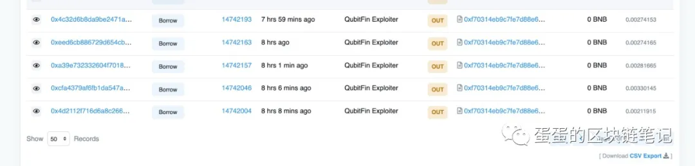

# 藏在 EOA 地址里的魔法 — Qubit Finance 被黑分析

## 前言

2022 年 1 月 28 日，一大早醒来就看见 ps 那边预警了 Qubit Finance 被黑了。有点惨，这是印象中 pancake bunny 项目不知道第几次被黑了（这里默哀。。）。然后顺着 Qubit Finance 官方的推特，不难找到这次的攻击者地址为



既然知道了地址，那么老样子，话不多说，直接开始分析吧 :D

## 攻击细节分析

由于通过 Qubit Finance 我已经拿到了攻击者的具体地址，所以我就直接对 BSC 上的攻击者地址进行查询，看看是做了什么操作。

通过追查攻击者在 BSC 链上的操作，发现攻击者根本没有什么准备资金啊，部署攻击合约之类的操作，直接上来就是 `borrow`， 这种操作很陌生，只有两种可能，要不就是这个 `borrow` 有问题，直接就是通过 `borrow`就借空所有资产，还有一种可能就是，这里不是`第一案发现场`。为了验证这种想法，就需要先看看对应的 `borrow` 函数是什么鬼。

简单一看这个 `borrow` 函数，明显是属于 `Compound` 的架构，是有抵押品才能进行对应的抵押的，同时#238的 `borrowAllowed` 函数我也检查过确实是有正确实现对代币价值的检查的。那就说明第一种假设不成立，也就是说，这里确实`不是第一案发现场`。那么如果借贷的逻辑是正确的，那么攻击者理论上来说，会收到由于`第一案发现场`弄过来的钱来进行借贷。那么攻击者的钱又是怎么来的呢？带着这个疑问，不妨看下攻击者地址的代币转移情况。

通过追查攻击者的代币转移情况，发现攻击者在对 Qubit Finance 进行借贷之前，就已经在其他地方神秘的收到了好几笔大额的 `qXETH` 代币，那么这也验证了我们的想法，说明借贷操作已经是攻击后行为了，并不是`第一案发现场`，为了弄明白这些神秘的资金是怎么来的，我们需要选取其中的一笔交易进行分析(https://bscscan.com/tx/0x8c5877d1b618f29f6a3622cb610ace08ca96e04d8218f587072a3f91e8545bdc)

通过分析这笔交易，发现这笔交易其实是调用了 `Qubit Finance` 的 `Qbridge` 合约的 `voteProposal` 函数。

但是问题是这个 `voteProposal` 其实是只有合约指定的 `relayer` 才能进行调用的，难道是 `Relayer` 的私钥泄漏了吗？正常来说如果不了解 `Qubit Bridge` 的架构的话，得出这个结论是显而易见的。

但是似乎事实并不是这么简单。有一种神秘的感觉告诉我事情并不是这样的。正常来说，对于这种 `relayer` 架构的跨链，如果是通过 `relayer` 进行的操作的话，那么一定会有一步在其他链进行的跨链操作，声明了一个 `event`，然后才有 `relayer` 同步到这个 `event` 然后开始对应代币的跨链，就像 `anySwap` 一样，那么基于这种假设，同时攻击者跨链的又是 `ETH`, 那么攻击者是大概率在`ETH` 链上进行了一次跨链操作的。为了验证这个想法，我去查了一下 `ETH` 链上的攻击者的行为，果不其然。。。

可以看到攻击者确实进行了很多笔跨链操作，调用了 `QBridge` 在以太坊上的合约进行代币的跨链，看来这里就是`第一案发现场了` ，选取其中的一笔交易进行分析，发现更加异常的地方。

理论上攻击者应该跨链`ETH`到`BSC`链上，但是这笔交易里既没有`ETH`的转账，也没有`WETH`的转移，是怎么回事呢？这需要我们追踪对应合约的 `deposit` 函数来进行分析

通过查看这个代码，我们不难发现，如果要跨链接 `ETH`，根据代码的函数命名来看，应该是要调用 `depositETH` 函数的，但是攻击者却调用了 `deposit` 函数来进行 `ETH` 的跨链？为什么可以这样？回顾上文说的架构，我们知道，`Relayer` 架构是依赖 `event` 消息进行进行跨链的，而这 `depositETH` 和 `deposit` 这两个函数，是声明同一个 `event` 的，那么就是说，如果有机会能让 `deposit` 函数声明的 `event` 的参数就是 `ETH` 代币跨链的参数的话，`depositETH` 和 `deposit` 这两个函数实现的效果其实是一样的，那么问题到这里就简化了，由于这两个函数的传参都是一样的，只要按调用 `depositETH` 的参数来调用 `deposit` 不就好啦？

思路是对的，但是这里还有一个问题，别忽略了 #208 行的 `handler` 检查，这个检查是 `deposit`函数和 `depositETH` 函数都有的，按上面的这个思路，能通过检查吗？为了验证这个想法，我们要去看对应 `handler` 合约的的代码

通过分析 `handler` 合约的代码，发现 `handler` 同样存在  `deposit` 函数和 `depositETH` 函数，同时，`deposit` 函数是在 #128行有白名单检查的，配合图中标注的 #135 行的 `safeTransferFrom` 调用也就是说，攻击者理论上是要转移代币的，而攻击者的的攻击交易中，没有出现代币的转移，理论上这里应该要报错才对？为什么成功了呢？回看代码，`tokenAddress` 的获取是通过 `resourceIDToTokenContractAddress` 进行获取的，那么这个地址是啥呢？通过查询合约，我们得到了 `ETH` 代币对应的 `resourceID` 的代币合约地址是 `0x0000000000000000000000000000000000000000`

哎，这里就有同学想来问啦，0地址不就是没有设置过的意思吗？为什么一个没有设置过的地址能通过检查呢？于是我们就不死心的去查这个地址是不是真的是在白名单里，结果一查，哎？结果还真是，芭比Q了&#x20;

为什么会有这个操作呢？回顾刚才的代码，由于 `QBirdgeHandler` 的 `depositETH` 函数同样是包含白名单检查的，但是充值 `native ETH` 它没有代币合约哇，怎么做白名单检查呢？`QBridge` 采用了一个大多数项目都会采用的办法，那就是如果你充值的是 `native ETH` 代币，那么我在合约里就当你是充值 0 地址的代币，也就是说，你充值 0 地址的代币，就认为你充的是 `ETH` 啦。

那第二个问题来啦，0 地址的调用是怎么成功的？哎？这就是一个有趣的问题啦，我们知道，0地址其实是一个 `EOA` 地址，那么 `EOA` 地址中是没有合约代码的，那么在 `evm` 的实现中，对 `EOA` 地址的调用是不会报错的，同时也不会执行任何操作。一个老 `trick`:D, 这个 trick在19年的 0x protocol 上出现过

也就是说， 0 地址直接就成功调用 `safeTransferFrom` 函数而没有报错啦，但是，`handler` 的检查和调用结束后，对应的在 `QBridge`合约声明出来的 `event`，却是和转入了 `ETH` 是一模一样的哦。但是 `relayer` 哪知道这么多，它只是一个执行 `event` 捕获的云服务器而已 :D

## 总结

这次 `Qubit Fiance` 的被黑其实同时存在了好几个问题

1. 最大的问题，自然是 `EOA` 调用的问题，其实是不会报错的，这个问题没有被意识到
2. 但是除了这个问题之外，还需要结合 `depositETH` 和 `deposit` 函数本身声明的是同一个类型的事件，不然也是不会出问题的

## 彩蛋

经过查询，`deposit` 函数以前是用来充值 `WETH` 的，而且用的 `resourceID` 和这次攻击用的 `ID` 是一样的，那么以前的调用是正常的，那么为什么现在就不正常呢？肯定是有人改过嘛 :D

然后果不其然，我还真的找到了&#x20;

\

而这个函数，只有 `owner` 才能调用，为什么要这样搞呢？细节请大家发挥联想，我的分析之旅到这里就结束了 ;)

